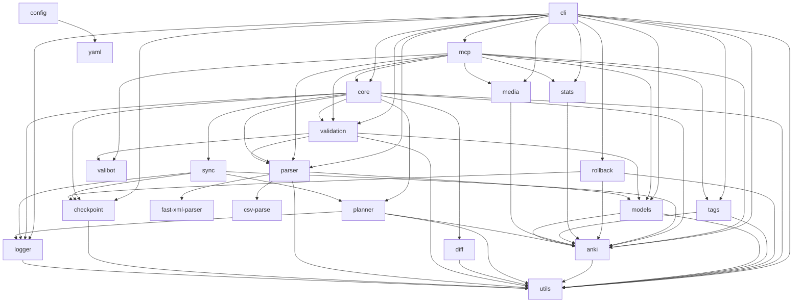

# Monorepo architecture (v0.0.4)

`anki-xml` is a bun 1.4 monorepo (bun-workspace.yaml globs `packages/*`
and `apps/*`) with 18 packages, one dev app, and root-level tests. The
single build artifact is `dist/cli.js` — a bundled rslib ESM binary
(`bin: anki-import` / `anki-xml`) built from `packages/cli/src/index.ts`.

## 1. Folder structure

```
ankiXML/
├── package.json            # root; version 0.0.4, bin entries, workspace deps
├── package.json workspaces     # packages/*, apps/*
├── vitest.config.ts        # tests/**/*.test.ts + packages/**/tests/**/*.test.ts
├── tsconfig.json
├── scripts/
│   ├── build.mjs           # rslib single-bundle build → dist/cli.js
│   ├── version-sync.mjs    # sync version across root/packages/apps/help.ts
│   └── smoke-mcp.mjs       # MCP stdio handshake smoke test
├── dist/cli.js             # built artifact (~153 KB)
├── apps/
│   └── playground/         # dev harness (src/dev.ts; tsx, not published)
├── examples/               # basic.xml, all-note-types.xml, html.xml,
│                           # html-and-latex.xml, math.xml, issue-cases.xml,
│                           # cards.{yaml,json,csv,md}
├── schema/anki.xsd
├── skills/anki-import-cli/  # CLI skill (recommended; SKILL.md, examples/)
├── skills/anki-import-mcp/  # MCP skill (SKILL.md, tool table)
├── tests/                  # 15 vitest files (see testing-strategy.md)
└── packages/
    ├── utils/       src/{index,types,files,hash,retry,format}.ts   # shared types + helpers, no deps
    ├── logger/      src/{index,logger}.ts                          # leveled logger (error→stderr)
    ├── checkpoint/  src/{index,checkpoint}.ts                      # JSON checkpoints ($XDG_DATA_HOME/anki-import/checkpoints)
    ├── config/      src/{index,config}.ts                          # anki.config.{json,yaml,yml} discovery
    ├── anki/        src/{index,ankiconnect,errors}.ts              # AnkiConnect client + diagnostics (ONLY network package)
    ├── models/      src/{index,models,anki}.ts                     # note-type registry (Basic/Cloze/…) + Anki model introspection
    ├── parser/      src/{index,tokenize,cdata,xml-parser,xml-stream,
    │                    structured,yaml-parser,json-parser,csv-parser,
    │                    markdown-parser}.ts                         # XML tokenizer + stream + yaml/json/csv/md parsers
    ├── validation/  src/{index,schemas,validate}.ts                # Valibot schemas + model rules
    ├── planner/     src/{index,planner}.ts                         # buildPlan: add/update/remove/duplicates/unchanged
    ├── diff/        src/{index,diff}.ts                            # diffNote/diffNoteLists/diffDecks/diffTags
    ├── sync/        src/{index,sync}.ts                            # applyPlan + driftFromCheckpoint
    ├── rollback/    src/{index,rollback}.ts                        # delete notes from a checkpoint
    ├── tags/        src/{index,tags}.ts                            # list/add/remove tags (chunked)
    ├── media/       src/{index,media}.ts                           # store/retrieve/delete media files
    ├── stats/       src/{index,stats}.ts                           # deck/collection statistics
    ├── core/        src/{index,doctor,plan,sync-file,diff-file,watch}.ts
    │                src/importer/import.ts                         # import pipeline orchestration
    │                src/plugins/{types,registry,xml-plugin,exporter-json}.ts  # plugin API
    ├── cli/         src/{index,run,args,help,errors}.ts
    │                src/commands/{open,doctor,validate,plan,diff,import,sync,
    │                              rollback,checkpoint,watch,tags,models,
    │                              stats,media,benchmark,mcp}.ts      # argv wiring only
    └── mcp/         src/{index,protocol,server,tools}.ts           # MCP stdio server (JSON-RPC 2.0, 18 tools)
```

## 2. Package responsibilities

- **utils** — shared in-memory types (`ParsedNote`, `ValidatedNote`,
  `AnkiConnectNote`, `Checkpoint`, `ImportResult`, …) plus zero-dep
  helpers: `withRetries`/`chunkArray`, `parseTagList`,
  `toAnkiConnectNote`, and file I/O. No dependencies; everything else
  depends on it.
- **logger** — leveled logger (`error|warn|info|debug`). Errors and
  warnings go to stderr, info/debug to stdout; `--json`/`--quiet` clamp
  the level so stdout stays protocol-clean.
- **checkpoint** — JSON snapshots `{id, deck, created, noteIds}` under
  `$XDG_DATA_HOME/anki-import/checkpoints` (or `~/.local/share`), written
  atomically (tmp + rename). Create/load/list/delete.
- **config** — walks up from cwd looking for `anki.config.json` /
  `anki.config.yaml` / `anki.config.yml` (in that precedence order) and
  normalizes `deck` / `model` / `url` keys.
- **anki** — the only package that talks to AnkiConnect. `AnkiClient`
  wraps the HTTP API (version 6) with retries/backoff/timeout and
  `fetchImpl` injection for tests. `errors.ts` classifies failures into
  stable causes (`refused|timeout|http|bad-json|network|ok|unknown`)
  with ordered `hints` and a `suggestion`.
- **models** — the built-in note-type registry (`Basic`,
  `Basic (and reversed card)`, `Basic (optional reversed card)`,
  `Basic (type in the answer)`, `Cloze`) with field-acceptance sets,
  required fields, content checks, and `buildFields` mapping; plus
  `createCustomModel` and Anki-side introspection (`listModels`,
  `fields`, `templates`) via `AnkiClient`.
- **parser** — canonical XML path: a source-byte tokenizer that never
  decodes entities (CDATA/comments/PIs are distinct tokens), full-document
  and streaming parsers, CDATA→HTML escaping with void-tag support; and
  the non-XML format parsers (YAML/JSON/CSV/Markdown) that map onto the
  same `ParsedNote` model.
- **validation** — Valibot shape checks (`NoteSchema`) plus model rules
  (unsupported type, missing/duplicate/unknown fields, empty content,
  Cloze markers, addReverse yes/no), duplicate-id detection, and
  line-aware error objects. Gates all mutation.
- **planner** — `buildPlan`: notes with `id=` are update targets
  (checked via `notesInfo`), notes without are gated by `canAddNotes`;
  produces add/update/remove/duplicates/unchanged without mutating.
- **diff** — pure diff helpers: `diffTags`, `diffDecks`, `diffNote`,
  `diffNoteLists` (matched by id when both sides have one, else number).
- **sync** — `applyPlan` creates decks, adds notes, updates fields, and
  writes a checkpoint; `driftFromCheckpoint` reports which checkpoint
  notes still exist. `sync` both creates and updates; `import` only creates.
- **rollback** — loads a checkpoint and deletes its notes via
  `deleteNotes`; dry-run support; deletes the checkpoint file unless
  `keepCheckpoint`.
- **tags** — tag list/add/remove against an `AnkiClient`, batching note
  ids in chunks of 500; `parseTagList` splits whitespace-separated tags.
- **media** — store/retrieve/delete/list files in the Anki media folder
  (base64 over AnkiConnect), with file↔media helpers.
- **stats** — per-deck card counts and collection totals (decks, models,
  notes via `findNotes("deck:*")`, cards).
- **core** — orchestration: `importFromFile` (parse→transform→validate→
  batch→AnkiConnect, with the XML streaming fast path), `planFile`/
  `syncFile`/`diffFile`/`watchFile`, `runDoctor`, and the plugin registry.
- **cli** — argv parsing (`parseArgs`), command dispatch in `run.ts`,
  help text, and exit-code rendering. Contains no business logic;
  every command delegates to `@anki-xml/core` or the other packages.
- **mcp** — SDK-free MCP server over stdio: JSON-RPC 2.0 framing,
  `initialize`/`tools/list`/`tools/call`, 18 tools validated with
  Valibot, AnkiConnect errors surfaced as `error.data` with the
  cause/hints/suggestion envelope.

## 3. Dependency graph



External (npm) dependencies — bundled unless marked *external*:

| Dep | Used by | Bundled? |
|---|---|---|
| `fs.watch` (builtin) | core (`watch`) | — |
| `yaml` | parser, config | external |
| `csv-parse` | parser | external |
| `fast-xml-parser` | parser (`XMLValidator`) | bundled |
| `valibot` | validation, mcp | bundled |

Only `cli`, `mcp`, `core`, `anki`, and the leaf packages appear at the
top of the graph; `utils` sits at the bottom — every package depends on
it, and it depends on nothing.

## 4. Design rules

1. **XML is canonical.** Never JSON-first for cards. YAML/JSON/CSV/Markdown
   map onto the same in-memory note model via importer plugins.
2. **No business logic in `packages/cli/src/commands/*`** — command files
   only parse flags and render output.
3. **No Bun-only APIs** (`Bun.file`, `Bun.write`, `Bun.spawn`) — Node 20+.
4. **Never decode XML entities in field content** — the tokenizer slices
   source bytes; `&amp;` stays `&amp;` in Anki fields.
5. **CDATA escaping** — `escapeCdataForHtml` escapes bare `&`, `<`, `>`
   but never double-escapes existing entities.
6. **Void HTML tags (`br`, `img`, …) are unpaired** — `HTML_VOID_TAGS`
   is passed to the XML validator and to the tokenizer.
7. **Validation gates mutation** — nothing is sent to AnkiConnect until
   every note passes `validateNotes` (plus validator plugins).
8. **`--json` changes output only, not control flow** — no command behaves
   differently under `--json` except formatting; stdout stays clean (a
   single JSON document, logs on stderr).
9. **Error codes are stable** — branch on `code`, never on `message`.
10. **Only `packages/anki` may talk to AnkiConnect** — all other packages
    take an `AnkiClient` (or `url`/`fetchImpl`) as a parameter.
11. **MCP stdout is protocol-clean** — stdio carries JSON-RPC only, no log
    lines.
12. **`import` creates notes only; `sync` creates AND updates** — notes
    with `id=` are update targets and are rejected by `import` ("use
    'sync'").

## 5. Performance targets

| Target | How it is met |
|---|---|
| Fast startup (≈25 ms) | One rslib bundle (`dist/cli.js`, ≈153 KB); heavy deps (`yaml`, `csv-parse`) are `external` and lazy-imported inside the functions that need them |
| Constant-memory large imports | `--stream` uses `parseXmlStream`: a CDATA-aware scanner finds `<note>` spans in a rolling buffer (bounded to ~2 MB), each fragment parsed with the same tokenizer, notes batched (default 500) and flushed to AnkiConnect |
| No double parsing | The stream path validates per note without ever building the full document AST |
| Measurable | `benchmark <file>` measures parse+validate throughput (`cards`, `memoryMb`, `timeSec`, `rate`); `bun run build` prints the bundle size |
| Reproducible imports | Atomic operations, batch defaults, `--dry-run` everywhere, checkpoints before mutation |
